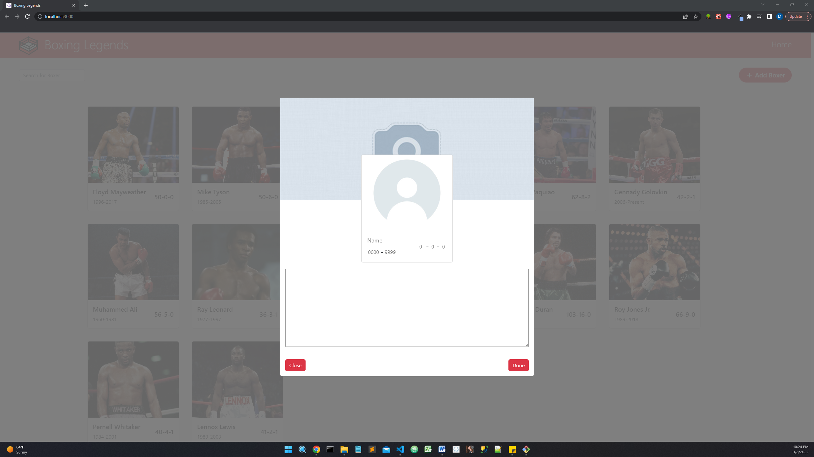
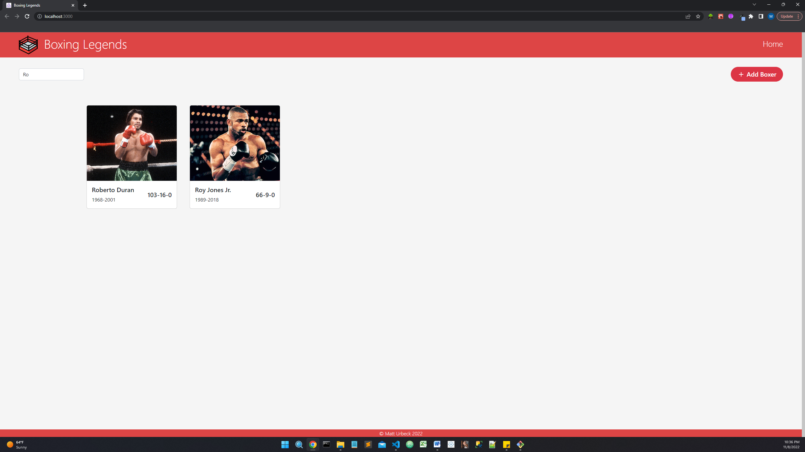
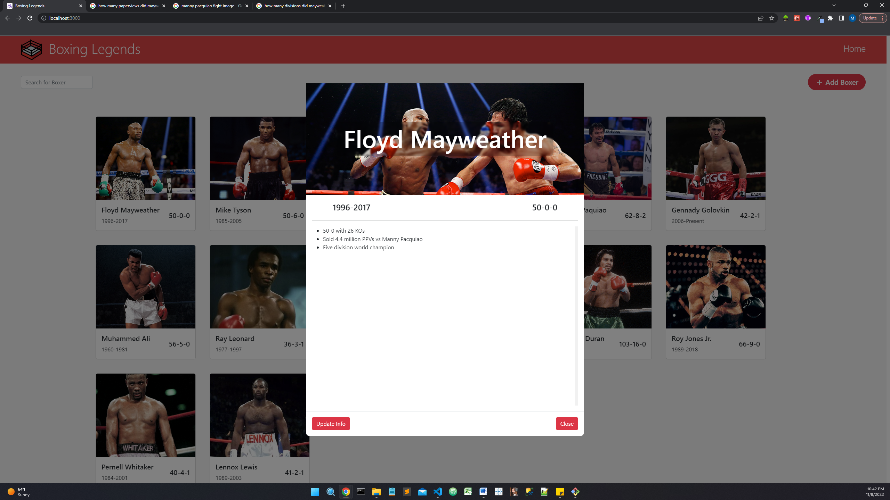
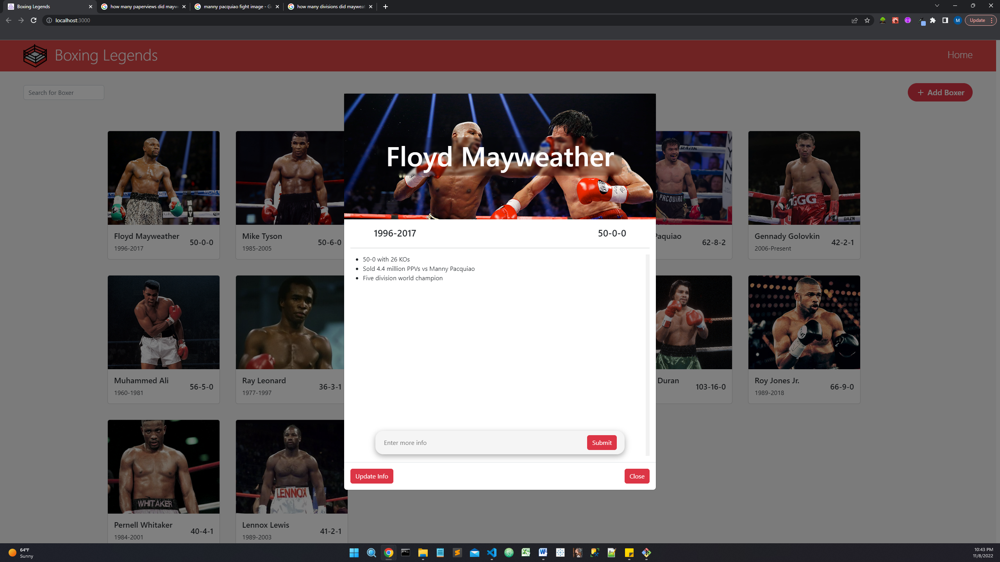

# Functionality of this application

## Home Page
- This is the home page that loads when the application is opened.

## Add New Boxer
- Clicking the "+ Add Boxer" button in the top right corner presents component seen below.
- Clicking the header image opens up your files for you to choose the image you want to upload.
- Clicking the profile picture opens up your files to choose the image you want to upload.
- "Name", "0000-9999", and "0-0-0" are inputs where you add the boxer's name, years active, and record respectively.
- The text area at the bottom is where you can add info about the boxer.
- Clicking "Done" uploads the new boxer and returns to the updated home page.
- Clicking "Close" returns to the home screen without saving the changes.

## Search for Boxer
- Clicking "Search for Boxer" in the upper left corner allows you to search for boxers present in the list.

## View Boxer
- Clicking on a boxer's card brings up the view in the image below.

## Update Info
- When a boxer card opened, clicking on "Update Info" brings up the component in the image seen below.
- New information can be typed in text bar and when "Submit" is clicked it will update the list of info and remove the text bar from view.

